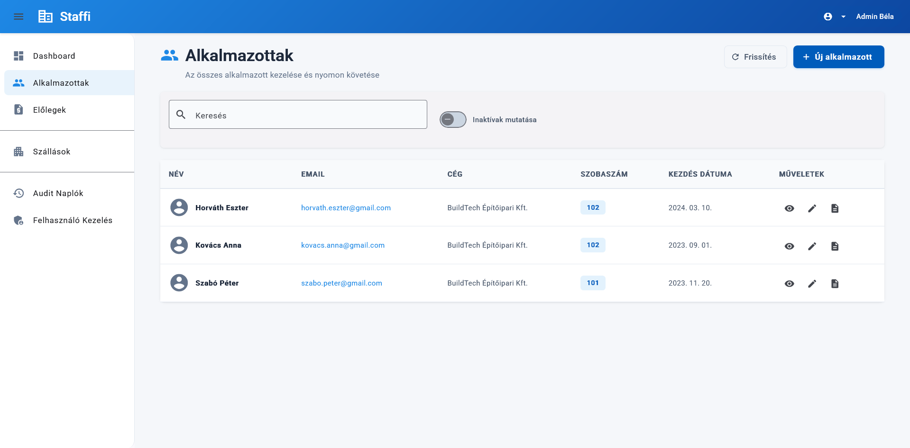
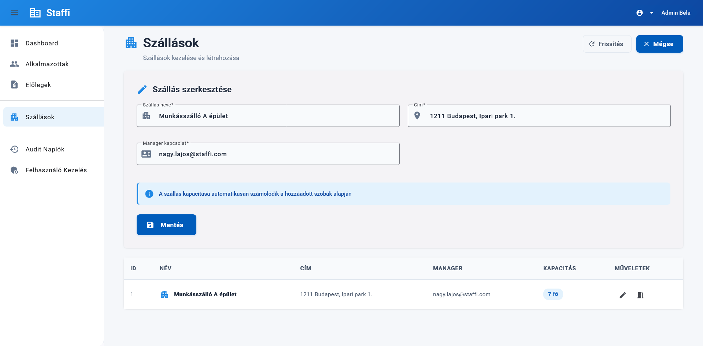
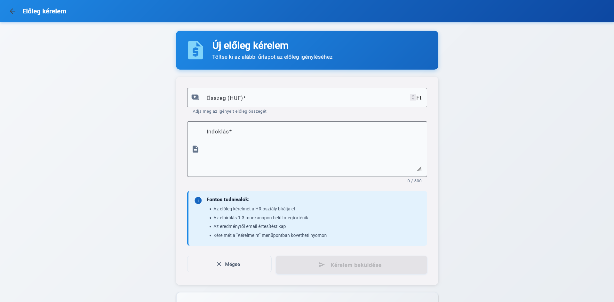
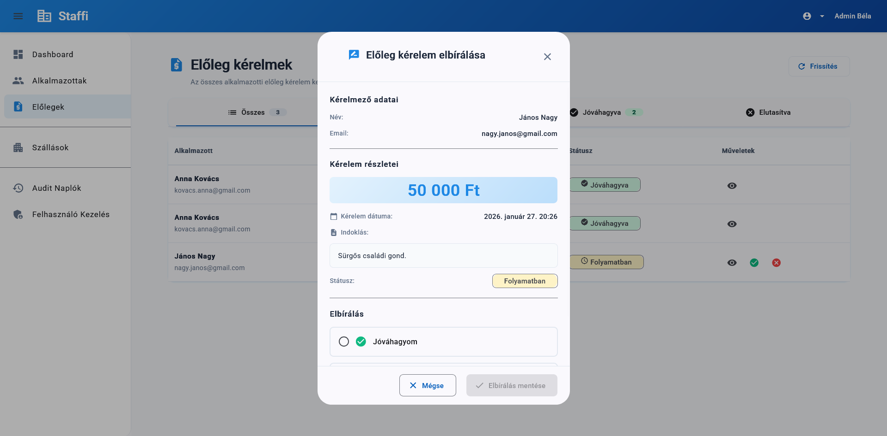
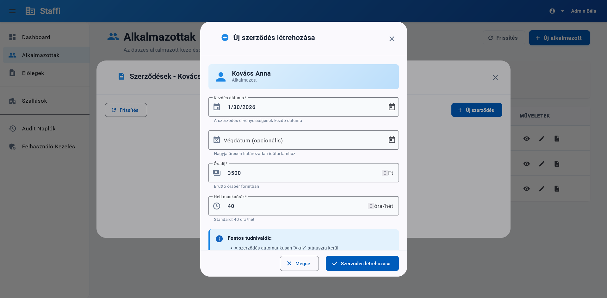

# User Documentation - Staffi

## 1. Bevezetés

### 1.1 Termék áttekintés
A **Staffi** egy modern, integrált vállalatirányítási rendszer, amelyet kifejezetten munkaerőkölcsönző cégek számára fejlesztettek ki. A platform célja, hogy egyetlen felületen kezelje a dolgozói nyilvántartást, a szálláshelyek menedzsmentjét és a pénzügyi előlegek folyamatát, kiváltva az elavult Excel táblázatokat és papíralapú adminisztrációt.

### 1.2 Célközönség
A rendszer két fő felhasználói csoportot szolgál ki:
* **HR Menedzserek / Adminisztrátorok:** Akik a dolgozók adatait kezelik, szerződéseket generálnak, és a szállásokat/pénzügyeket felügyelik.
* **Munkavállalók:** Akik a saját adataikat tekinthetik meg, és előleget igényelhetnek az önkiszolgáló felületen.

### 1.3 Előfeltételek
* **Eszköz:** Számítógép, tablet vagy okostelefon.
* **Böngésző:** Modern webböngésző (Google Chrome, Firefox, Microsoft Edge legfrissebb verziói).
* **Internet:** Stabil internetkapcsolat a szerver eléréséhez.

---

## 2. Első Lépések

### 2.1 Telepítés/Regisztráció
A Staffi egy webes alkalmazás, így **nem szükséges telepítés**. A rendszert a böngészőből érheti el a megadott webcímen.

* **Regisztráció:** A rendszer zártkörű. Új felhasználói fiókot (HR vagy Munkavállaló) csak a Rendszeradminisztrátor vagy a HR vezető hozhat létre az adminisztrációs felületen. A belépési adatokat emailben kapja meg.

### 2.2 Bejelentkezés
1.  Nyissa meg a bejelentkezési oldalt (`/`).
2.  Adja meg a regisztrált **email címét** és **jelszavát**.
3.  Kattintson a **Bejelentkezés** gombra.
4.  Sikeres azonosítás esetén a rendszer a szerepkörének megfelelő (HR vagy Dolgozói) Vezérlőpultra irányítja.

### 2.3 Alapvető beállítások
Bejelentkezés után a jobb felső sarokban található **Profil** menüben módosíthatja jelszavát.

---

## 3. Funkciók

### 3.1.1 Dolgozók Kezelése (Csak HR)
#### 3.1.2 Leírás
Teljes körű adatbázis a munkavállalókról, beleértve a személyes adatokat, adószámot, TAJ számot és a munkaviszony státuszát.

#### 3.1.3 Használat lépései
1.  Navigáljon a **Alkalmazottak** menüpontra (`/admin/employees`).
2.  **Új felvétele:** Kattintson a "Új alkalmazott" gombra. Töltse ki a mezőket
3.  **Szerkesztés:** Kattintson a dolgozó sorában található "Megtekintés" a részletes adatlap megnyitásához.
4.  **Keresés:** Használja a felső keresősávot név, e-mail, cégnév vagy szobaszám szerinti szűréshez.
5. **Módosítás:** Használja a "Szerkesztés" gombot az alkalmazott adatainak szerkesztéséhez.
6. **Szerződések:** Megtekintheti és létrehozhatja az alkalmazotthoz tartozó szerződéseket a "Szerződések" gombbal.

---

### 3.2.1 Szállás és Szobabeosztás (Csak HR)
#### 3.2.2 Leírás
A szálláshelyek (pl. Munkásszállók) és szobák kapacitásának kezelése, valamint a dolgozók beköltöztetése/kiköltöztetése.

#### 3.2.3 Be és kiköltöztetés
1.  Navigáljon a **Alkalmazottak** menüpontra (`/admin/employees`).
2.  Kattintson a "Szerkesztés" gombra a megfelelő alkalmazottnál.
3.  Ezen az oldalon meg tudja melyik szobába legyen beosztva.

#### 3.2.4 Szálláshely szerkesztése (Csak admin)
1.  Navigáljon a "Szállások" menüpontra.
2.  Az épület szerkesztéséhez kattintson a "Szerkesztés" gombra.
3.  Ha a szobákat szeretné szerkeszteni, kattintson a "Szobák kezelése" gombra.
4.  Válassza ki a szerkesztendő szobát a "Szoba szerkesztése gomb" segítségével, vagy törölje a szobát.

---

### 3.3.1 Előlegigénylés (Munkavállaló)
#### 3.3.2 Leírás
A dolgozók egyszerűen igényelhetnek fizetési előleget, amelyet a HR bírál el.

#### 3.3.3 Használat lépései
1.  Navigáljon az **Előlegkérés** menüpontra (`/employee/advance-request`).
2.  Adja meg az igényelt **Összeget** és az **Indoklást**.
3.  Kattintson a **Küldés** gombra.
4.  Az igény állapota (Függőben/Elfogadva/Elutasítva) a "Kérelmeim" listában követhető.

---

### 3.3.1 Előlegek Bírálata (Csak HR)
#### 3.3.2 Leírás
A beérkező igények jóváhagyása vagy elutasítása.

#### 3.3.3 Használat lépései
1.  Navigáljon a **Előlegek** menüpontra.
2.  A listában látja a `Folyamatban` státuszú kéréseket.
3.  Kattintson a **Részletek** gombra.
4.  Válassza az `Jóváhagyom` (Elfogadva) vagy `Elutasítom` (Elutasítva) opciót. Elutasítás esetén indoklás megadása kötelező.

---

### 3.4.1 Szerződés Generálás (Csak HR)
#### 3.4.2 Leírás
PDF munkaszerződés automatikus előállítása a dolgozó adatai alapján.

#### 3.4.3 Használat lépései
1.  Nyissa meg a Alkalmazottak oldalt.
2.  Kattintson a **Szerződések** gombra.
3.  Kattintson az **Új szerződés** gombra.
4.  Adja meg a szerződés paramétereit (Kezdés dátuma, Órabér, Pénznem).
5.  A rendszer létrehozza a PDF fájl, amit utána le tud tölteni a megfelelő gombbal.

---

## 4. Gyakori Feladatok

* **Hogyan ellenőrizhetem, hol lakik egy dolgozó?**
    Keresse ki az alkalmazott listában, és ott tekintse meg az összes adatai között.
---

## 5. Hibaelhárítás

### 5.1 Gyakori hibák
* **"Helytelen bejelentkezési adatok" (401 Unauthorized):** Hibás email cím vagy jelszó.
* **"Nincs jogosultsága a művelethez" (403 Forbidden):** Olyan funkciót próbál elérni, ami nem tartozik a szerepköréhez (pl. Dolgozóként próbál új embert felvenni).

### 5.2 Megoldások
1.  Ellenőrizze az internetkapcsolatot.
2.  Frissítse az oldalt (F5).
3.  Jelentkezzen ki, majd be újra.
4.  Ha a hiba továbbra is fennáll, jegyezze fel a hibaüzenetet és lépjen kapcsolatba az IT támogatással.

---

## 6. Gyakran Ismételt Kérdések (GYIK)

**K: Láthatom mások szállásbeosztását?**
V: Nem, adatvédelmi okokból minden dolgozó csak a saját szobájának információit látja (`MyRoomInfoDto`).

---

## 7. Támogatás

### 7.1 Kapcsolatfelvétel
Technikai probléma vagy kérdés esetén kérjük, keresse a belső IT supportot:
* **Email:** email@sztibor.hu

### 7.2 Hibajelentés
Hiba jelentésekor kérjük, adja meg az alábbiakat:
* Felhasználó neve.
* Az oldal, ahol a hiba történt.
* A hibaüzenet pontos szövege.
* Képernyőkép (ha lehetséges).